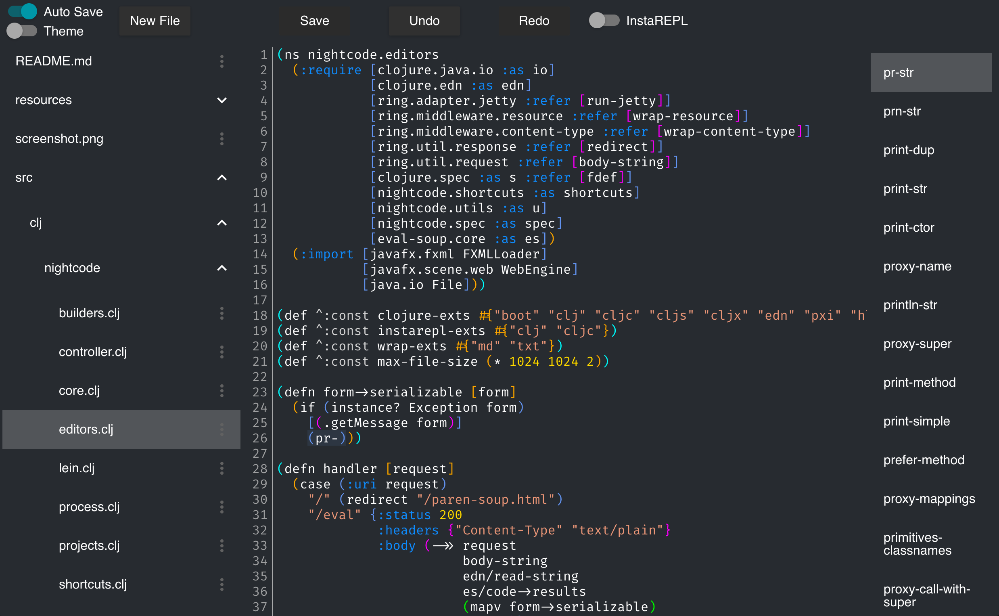

## Introduction

Nightlight is an editor you run *inside* your Clojure projects. Instead of being a separate application like traditional editors and IDEs, it's just a library that you add to your project. It spins up a web server and provides a completely browser-based interface to edit your code.

By running inside your project, it has complete access to the running state of your program. The ambition is to create something that follows the Lisp and Smalltalk tradition, blurring the line between your tools and your code to provide unprecedented interactivity.

See [the website](https://sekao.net/nightlight/) for instructions on how to use it.

## Development

* Install [the Clojure CLI tool](https://clojure.org/guides/getting_started#_clojure_installer_and_cli_tools)
* To develop with figwheel: `clj -A:dev:cljs dev.clj`
* To build the release version: `clj -A:prod:cljs prod.clj install`

## Licensing

All files that originate from this project are dedicated to the public domain. I would love pull requests, and will assume that they are also dedicated to the public domain.
